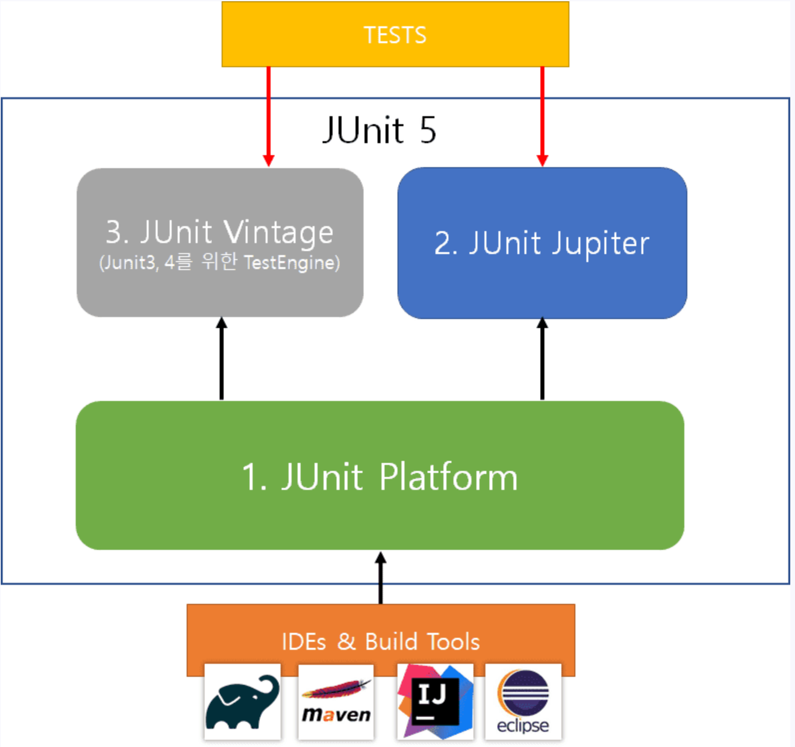

# JUnit 5

## 1. 개요
자바 개발자가 가장 많이 사용하는 테스팅 프레임 워크
- 단위 테스트를 작성하는 자바 개발자의 대부분이 JUnit을 사용
- 필요 조건 : 자바 8 이상
- JUnit 5 = JUnit Platform + JUnit Jupiter + JUnit Vintage

Platform : 테스트를 실행해주는 런처 제공. TestEngine API 제공 

Jupiter : TestEngine API의 구현체로 JUnit 5를 제공.

Vintage : JUnit 4와 3을 지원하는 TestEngine 구현체

